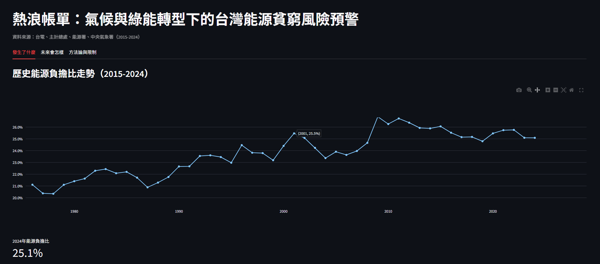

# 熱浪帳單 HeatBill

> 一台老舊冷氣，一個不敢按下開關的家庭。氣候越來越熱，電費帳單也越來越沉——這不只是一個故事，而是可以用公開資料驗證的趨勢。HeatBill 用四個官方資料源，把「氣候暖化」與「綠能轉型」這兩股同時發生的力量，量化成台灣低所得家庭具體要承擔的能源負擔風險。

## Demo
[線上互動 Dashboard](https://heatbill-energy-poverty-forecast-05.streamlit.app)

### 情境模擬展示

https://github.com/user-attachments/assets/替換成你上傳demo.mp4後GitHub自動產生的連結

## 這代表什麼

2026年，台灣最低所得組家庭平均可支配所得約【disposable_income萬元】，估算水電燃氣支出約【utility_expense_est萬元】——換句話說，每 100 元收入裡，約有【energy_burden_ratio*100取整數】元花在水電燃氣上。

這個數字不是孤立的統計巧合，而是氣候暖化跟綠能轉型兩股力量疊加的具體證據。當冷房需求逐年升高、電價因能源轉型持續調整，最脆弱的家庭承受的壓力會是雙倍的。對政策制定者而言，這代表家電汰換補助不該只看「省了多少電」，而該優先鎖定能源負擔比最高的族群；對社會而言，這代表能源轉型的討論不能只談減碳目標，也要把「誰在承擔轉型成本」放進同一張表格裡看。

## 開發過程中的真實挑戰

這個專案最大的挑戰不是建模，是資料本身。官方公開資料裡，「所得五分位」跟「消費類別細項」從未同時交叉呈現過——沒有一張表格能直接告訴你「最低所得家庭花多少錢在水電燃氣上」。第一次下載時，我甚至抓錯了統計表（抓到所得分配比而非實際金額），才發現這個資料缺口的存在。

面對這個缺口，我沒有用不精確的資料硬做，而是改用「全國消費結構占比 × 該所得組總消費支出」的方式合理估算，並在下方方法論段落誠實揭露這是一個簡化假設。這個過程，加上處理過程中遇到的編碼錯誤、Excel 舊格式（.xls）相容性問題、政府資料欄位結構不一致等真實狀況，讓我更清楚：資深分析師的價值不只在建模能力，更在於資料不完美時仍能找出可驗證、可解釋的替代路徑，而不是假裝資料很乾淨。

## 資料來源

本專案所用資料均來自政府資料開放平臺（data.gov.tw）與行政院主計總處、經濟部能源署、中央氣象署公開統計，符合政府資料開放宣告。

- 台灣電力公司歷年電價
- 主計總處家庭收支調查：可支配所得、消費支出結構
- 經濟部能源署能源統計月報：再生能源發電占比
- 中央氣象署CODiS逐日氣溫（台北測站）

## 方法論與關鍵假設

- 能源負擔比 = 最低所得組水電燃氣估算支出 ÷ 最低所得組可支配所得
- 因官方公開資料未提供按所得五分位交叉之水電燃氣細項支出，本專案以全國「住宅服務水電瓦斯及其他燃料」消費結構占比，推估最低所得組的水電燃氣支出，此為簡化假設
- 冷房度日（CDD）以日平均溫超過26°C的部分逐日累加，逐年加總

## 模型與評估

比較 Baseline（Naive Forecast）與 Prophet（多變量迴歸，外生變數：CDD、電價、再生能源占比）：

| 模型 | MAE | RMSE | MAPE |
|---|---|---|---|
| Baseline | 0.0044 | 0.0053 | 1.74% |
| Prophet | 0.0094 | - | - |

**關鍵發現**：初版僅10筆訓練資料時，Prophet MAE為0.0178；補齊資料至18筆（2007-2024）後，Prophet MAE降至0.0094，證實資料量對多變量時間序列模型穩定性的關鍵影響。即使如此，Baseline在此資料規模下仍優於Prophet，顯示此類問題可能需要更長期的資料累積才能穩定超越簡單基準——這是誠實的實驗發現，而非模型實作錯誤。

## 技術棧
Python, Pandas, Prophet, scikit-learn, Streamlit, Plotly

## Future Work

**下一步規劃：導入 SARIMAX 做係數層級分析**。相較於 Prophet 產出的是「預測曲線」，SARIMAX 能提供如「電價每上漲1元對能源負擔比的邊際影響為X個百分點」等可直接解釋的迴歸係數。這能讓分析成果從「這是趨勢預測」進一步轉化為「這是可以直接支持政策討論的量化槓桿」，是本專案從預測工具走向決策支援工具的關鍵一步。

其他規劃：
- 持續累積更多年份資料以改善模型穩定性
- 加入最高溫/最低溫、連續高溫日數等進階氣象特徵
- 若未來有按所得分位交叉的細項消費支出公開資料，替換現行估算假設

## 本機執行
\`\`\`
git clone https://github.com/overflowingshiawase/Heatbill-Energy-Poverty-Forecast.git
cd Heatbill-Energy-Poverty-Forecast
pip install -r requirements.txt
streamlit run dashboard/app.py
\`\`\`
cd Heatbill-Energy-Poverty-Forecast
pip install -r requirements.txt
streamlit run dashboard/app.py
\`\`\`
